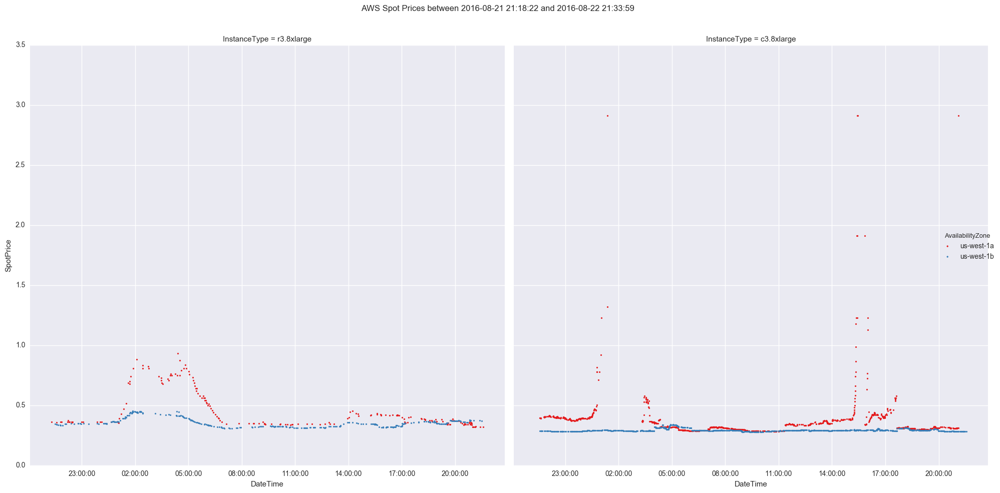
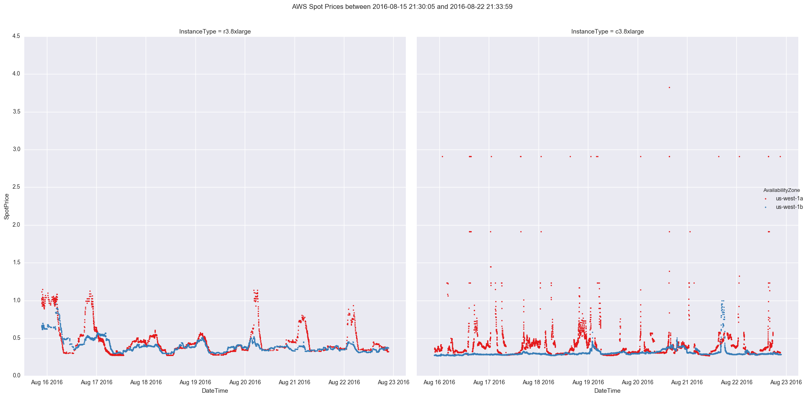

# spot-price-reporter

Simple python package that will fetch and plot AWS spot prices for the given instance types. The
plots cover the past 24 hours and the past 7 days. There is a built in option to send these to a
specified slack channel

# Setup

1. Clone this repository then run `python setup.py install`. This is tested with Python 3, but may work
with Python 2 (no guarantees).
2. Create a slack API token from [https://api.slack.com/docs/oauth-test-tokens](https://api.slack.com/docs/oauth-test-tokens)
3. Put the token in an environment variable `SLACK_API_TOKEN`. You can also configure the slack
channel that is messaged by setting `SLACK_CHANNEL`. The default is `#aws`.

# Usage

```
$ ipython -- spot_reporter/cli.py --help
Usage: cli.py [OPTIONS] INSTANCE_TYPES...

Options:
  -a, --action [email|slack]  Determine if/how to send aws pricing report
  --output-dir TEXT           What directory to output files to, by default
                              /tmp/spot-reporter
  --end-time TEXT             Last time to check spot price for
  --region TEXT               AWS region, by default uses the environment
  --skip-generation           Skip file generation
  --help                      Show this message and exit.
```

## Example
Run a command like `ipython -- spot_reporter/cli.py --action slack r3.8xlarge c3.8xlarge` or
`aws_spot_price_history --action slack r3.8xlarge c3.8xlarge` to fetch
the reports for those instance types and upload the results to slack.




## Airflow Example

Below is an example of an Airflow DAG to run this every hour

```python
from airflow import DAG
from airflow.operators.bash_operator import BashOperator
from datetime import datetime, timedelta


default_args = {
    'owner': 'airflow',
    'depends_on_past': False,
    'start_date': datetime(2016, 8, 22),
    'retries': 1,
    'retry_delay': timedelta(minutes=1),
    }

dag = DAG('aws_spot_price_history', default_args=default_args, schedule_interval='@hourly')

run_all = BashOperator(
    task_id='run_all',
    bash_command='aws_spot_price_history --end-time {{ ts }} --action slack --output-dir /tmp/spot-reporter/{{ ts }} r3.8xlarge',
    dag=dag
)
```

